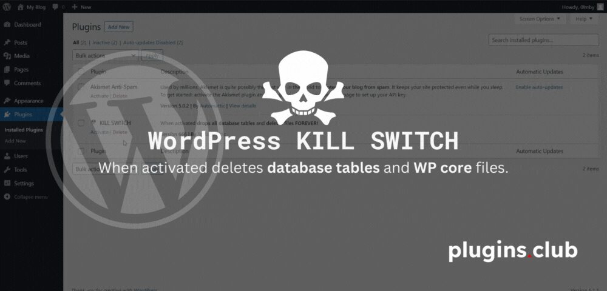

# 💀 WordPress KILL SWITCH

A simple WordPress plugin that when activated drops all database tables and removes WP core files.

[Screenshot](screenshots/wp-kill-switch.gif)

**Disclaimer**: This plugin is provided as is, and I cannot be held responsible for any data loss or other damages that may occur as a result of using it. You should use this plugin only on your own website, and you are responsible for making sure that it is safe to use and does not cause any unintended consequences. It is always a good idea to make a backup of your site before making any changes, including activating this plugin.

<a href="https://plugins.club">♣️ pluginsclub</a>

